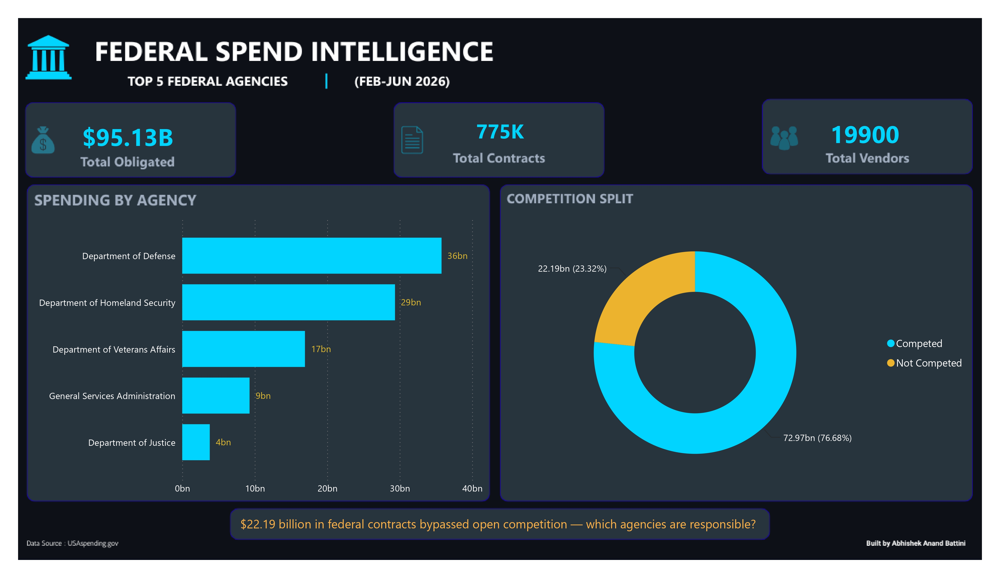
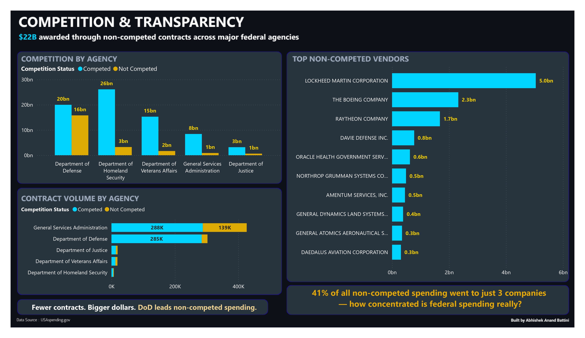
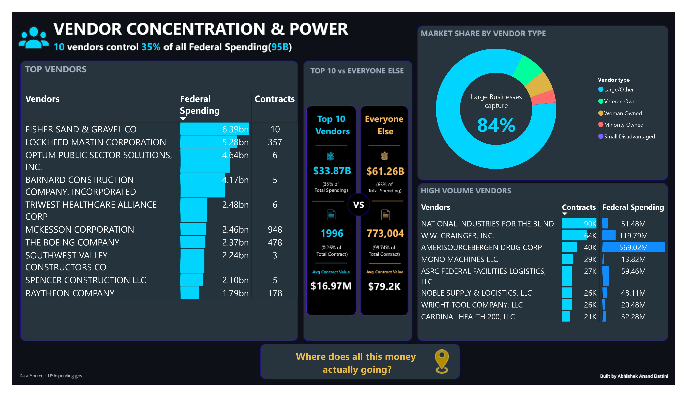
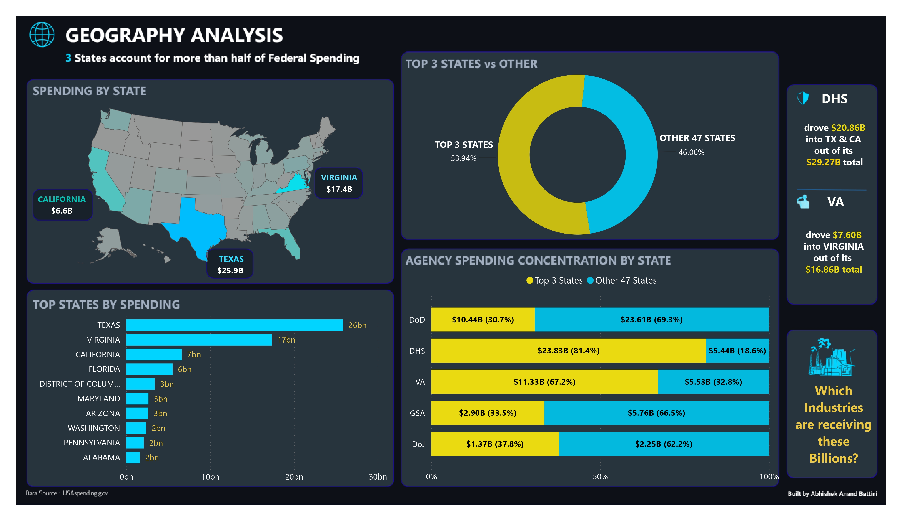
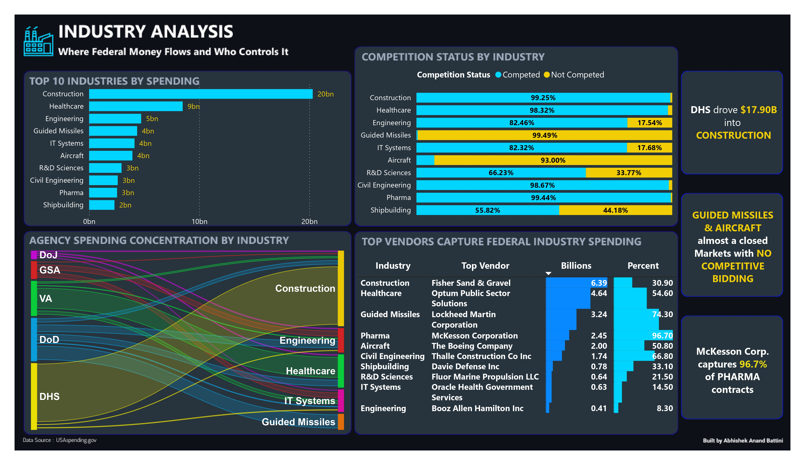
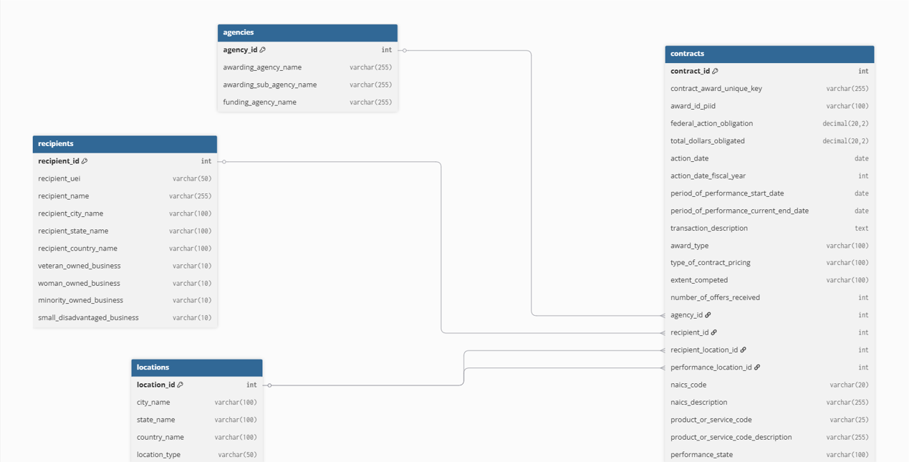

# Federal Spend Intelligence

> **$95B in federal contracts. 23% awarded without competition. 
> 3 companies captured 41% of non-competed spending.**

An end-to-end data analytics project analyzing 774,934 US federal 
contract records from USAspending.gov — covering data extraction, 
ETL pipeline, MySQL warehouse design, and a 5-page Power BI dashboard 
uncovering spending patterns, vendor concentration, and industry dynamics.

**[View Live Dashboard →]( https://app.powerbi.com/view?r=eyJrIjoiYTg5MjFmZjgtODEwYi00MzA3LTg4YjQtOTYwMDk1OGQzOTNiIiwidCI6IjAzNWRkZWY2LTI0MzMtNDhiNi04NTI2LTcwY2E4MTgxZjc2ZCIsImMiOjN9
)**


------
## 📊 Dashboard Preview

### Page 1: Executive Summary


### Page 2: Competition & Transparency


### Page 3: Vendor Concentration & Power


### Page 4: Geography Analysis


### Page 5: Industry Analysis


---

## 🔍 Key Findings

| Finding | Detail |
|---|---|
| **$22.19B bypassed competition** | 23% of all federal obligations awarded without competitive bidding |
| **3 companies, 41% of non-competed spend** | Lockheed ($5.04B), Boeing ($2.33B), Raytheon ($1.68B) |
| **3 states = 54% of spending** | Texas, Virginia, California dominate federal contract geography |
| **DHS drove $20.86B into 2 states** | 71.3% of DHS budget went to Texas + California alone |
| **McKesson controls 96.7% of federal pharma** | Competition doesn't guarantee market diversity |
| **Guided Missiles: 99.5% not competed** | Defense manufacturing relies heavily on limited competition procurement |

---

## 🏗️ Data Pipeline Architecture

USAspending.gov Bulk Data (6GB raw)
↓
Python — chunked ingestion, 32 of 297 columns selected
↓
Pandas — cleaning, deduplication, date parsing
↓
MySQL — 4-table normalized schema
↓
Power BI — DAX measures, 5-page dashboard

---

## 🗄️ Database Schema

4 normalized tables with foreign key relationships:

- **contracts** — 774,934 rows, core fact table
- **agencies** — 5 federal agencies (DoD, DHS, VA, GSA, DoJ)
- **recipients** — 19,900 unique vendors
- **locations** — 10,000+ unique performance locations



---

## 📁 Repository Structure

```text
federal-spend-intelligence/
├── README.md
├── sql/
| ├── schema.sql          # MySQL schema
| └── all_queries.sql     # All queries 
├── python/
│ ├── raw_to_clean.ipynb      # Chunked extraction, column filtering, cleaning
│ └── load_to_MySQL.ipynb     # Normalization, ETL, batch loading to MySQL
├── screenshots/ # Dashboard page images
└── dashboard/
  └── federal_spend_intelligence.pbix # Power BI file
```

---

## 🛠️ Tools & Skills

| Category | Tools |
|---|---|
| **Data Extraction** | Python, pandas (chunked reading) |
| **Database** | MySQL, SQL (window functions, CTEs, joins) |
| **Visualization** | Power BI, DAX |
| **Data Source** | USAspending.gov — FY2026 federal contracts |

---

## ⚡ The Most Surprising Finding

> I initially calculated **$1.4 trillion** in total spending. 
> A Department of Justice row showed two contracts worth $2.7 billion — impossible for that agency. 
> Investigating it revealed that `total_dollars_obligated` is a
> **cumulative ceiling for multi-year IDV contracts**, not money actually spent.
> The real figure — `federal_action_obligation` — was **$95 billion**.
> A 15x difference that changed every number in the dashboard.

---

## 📋 Data Source

- **Source:** [USAspending.gov](https://www.usaspending.gov/download_center/award_data_archive)
- **Scope:** FY2026 federal contracts, Top 5 agencies (DoD, DHS, VA, GSA, DoJ)
- **Period:** February – June 2026
- **Raw size:** ~6GB across 3 files, 297 columns
- **Working dataset:** 774,934 rows, 32 columns

---

*Built by Abhishek Anand Battini | Data Analyst*
*[LinkedIn]([www.linkedin.com/in/abhishekanandb])  
*[Dashboard]([https://app.powerbi.com/viewr=eyJrIjoiYTg5MjFmZjgtODEwYi00MzA3LTg4YjQtOTYwMDk1OGQzOTNiIiwidCI6IjAzNWRkZWY2LTI0MzMtNDhiNi04NTI2LTcwY2E4MTgxZjc2ZCIsImMiOjN9])*
